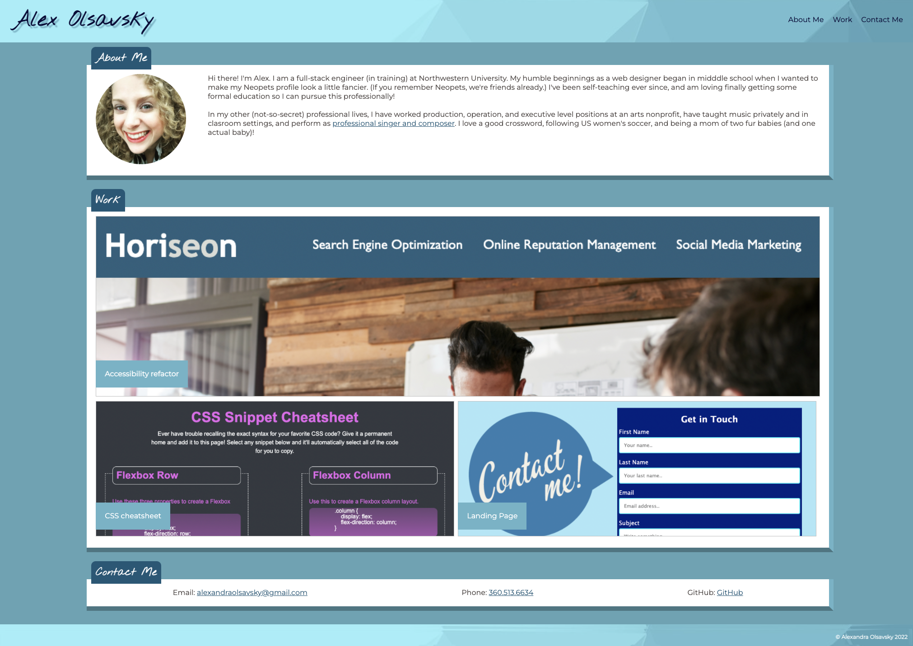

# portfolio

## Description

This project is a personal portfolio landing page, designed exclusively with CSS. Here is a [link to the deployed page](https://ajolsavsky.github.io/portfolio/).

Some things that I learned while creating this project:

- This page utilizes flexbox to achieve desired wrapping and formatting; I learned a lot about how to appropriately use this feature, and how to nest divs within semantic HTML writing to more delicately achieve styling results
- I got to use a:hover features for the first time in this project
- Additionally, I got to try a clipping mask for the headshot
- Media queries are utilized to get more specific results with smaller sized-browsers
- I used z-indexes and negative margins to achieve features that float over other features

## User Story

```
AS AN employer
I WANT to view a potential employee's deployed portfolio of work samples
SO THAT I can review samples of their work and assess whether they're a good candidate for an open position
```


## Acceptance Criteria

Here are the critical requirements necessary to develop a portfolio that satisfies a typical hiring manager’s needs:

```
GIVEN I need to sample a potential employee's previous work
WHEN I load their portfolio
THEN I am presented with the developer's name, a recent photo or avatar, and links to sections about them, their work, and how to contact them
WHEN I click one of the links in the navigation
THEN the UI scrolls to the corresponding section
WHEN I click on the link to the section about their work
THEN the UI scrolls to a section with titled images of the developer's applications
WHEN I am presented with the developer's first application
THEN that application's image should be larger in size than the others
WHEN I click on the images of the applications
THEN I am taken to that deployed application
WHEN I resize the page or view the site on various screens and devices
THEN I am presented with a responsive layout that adapts to my viewport
```

## Usage

Here is an example of the final page.



## Credits

This project and related assets are associated with the Triolgy Coding Bootcamp.

## License

© 2022 Trilogy Education Services, LLC, a 2U, Inc. brand. Confidential and Proprietary. All Rights Reserved.